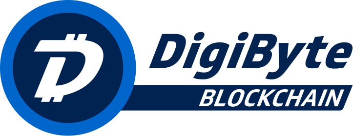

<<<<<<< HEAD

# Development is now occurring on the DigiByte-Core repo

As of 2020, development has now moved to the DigiByte-Core organization, under the digibyte repo

You can find more over at <https://github.com/digibyte-core/digibyte>

## What is DigiByte?
=======
DigiByte Core integration/staging tree
=====================================

https://digibytecore.org

For an immediately usable, binary version of the DigiByte Core software, see
https://digibytecore.org/en/download/.

Further information about DigiByte Core is available in the [doc folder](/doc).

What is DigiByte?
----------------

DigiByte is an experimental digital currency that enables instant payments to
anyone, anywhere in the world. DigiByte uses peer-to-peer technology to operate
with no central authority: managing transactions and issuing money are carried
out collectively by the network. DigiByte Core is the name of open source
software which enables the use of this currency.

For more information read the original DigiByte whitepaper.
>>>>>>> bitcoin/8.22.0

DigiByte (DGB) is a highly secure, decentralized, distributed and time-tested global blockchain that was founded in early 2014 with a focus on cyber security, payments & secure communications technologies.

<<<<<<< HEAD
For more information, as well as an immediately useable, binary version of the DigiByte Core software, see <https://digibyte.org>
=======
DigiByte Core is released under the terms of the MIT license. See [COPYING](COPYING) for more
information or see https://opensource.org/licenses/MIT.
>>>>>>> bitcoin/8.22.0

## DigiByte FAQ

<<<<<<< HEAD
**Launch Date**: January 10th, 2014

**Blockchain Type**: Public, Decentralized, UTXO based, Multi-Algorithm
=======
The `master` branch is regularly built (see `doc/build-*.md` for instructions) and tested, but it is not guaranteed to be
completely stable. [Tags](https://github.com/digibyte/digibyte/tags) are created
regularly from release branches to indicate new official, stable release versions of DigiByte Core.

The https://github.com/digibyte-core/gui repository is used exclusively for the
development of the GUI. Its master branch is identical in all monotree
repositories. Release branches and tags do not exist, so please do not fork
that repository unless it is for development reasons.

The contribution workflow is described in [CONTRIBUTING.md](CONTRIBUTING.md)
and useful hints for developers can be found in [doc/developer-notes.md](doc/developer-notes.md).
>>>>>>> bitcoin/8.22.0

**Ticker Symbol**: DGB

**Genesis Block Hash**: "USA Today: 10/Jan/2014, Target: Data stolen from up to 110M customers"

**Max Total Supply**: 21 Billion DigiBytes in 21 Years (2035)

**Current Supply**: 14,293,304,147 DGB (May 2021)

<<<<<<< HEAD
**Block Reward Reduction**: 1% Monthly

**Current Block Reward**: 520 DGB (May 2021)
=======
There are also [regression and integration tests](/test), written
in Python.
These tests can be run (if the [test dependencies](/test) are installed) with: `test/functional/test_runner.py`

The CI (Continuous Integration) systems make sure that every pull request is built for Windows, Linux, and macOS,
and that unit/sanity tests are run automatically.
>>>>>>> bitcoin/8.22.0

**Mining Algorithms**: Five individual: SHA256, Scrypt, Odocrypt, Skein & Qubit

**Block Interval**: 15 Second Blocks (75 seconds per algo)

**Algo Block Share**: 20% Block Share Per Algo (5)

**Difficulty Retarget**: Every 1 Block, 5 Separate Difficulties, independent difficulty for each Mining Algo

**SegWit Support**: Yes. First major altcoin to successfully activate Segwit. (April 2017)

**Hardforks**: 5. DigiShield, MultiAlgo, MultiShield, DigiSpeed, Odocrypt

**Softforks**: 3. SegWit, CSV, NVersionBits

You can mine DigiByte on one of five separate mining algorithms. Each algo averages out to mine 20% of new blocks. This allows for much greater decentralization than other blockchains. An attacker with 99% of of any individual algorithm would still be unable to hardfork the blockchain, making DigiByte much more secure against PoW attacks than other blockchains.

**DigiShield Hardfork**: Block 67,200, Feb. 28th, 2014

**MultiAlgo Hardfork**: Block 145k, Sep. 1st 2014

**MultiShield Hardfork**: Block 400k, Dec. 10th 2014

**DigiSpeed Hardfork**: Block 1,430,000 Dec. 4th 2015

**Odocrypt Hardfork**: Block 9,112,320 July 22nd 2019

## DigiByte vs Bitcoin

**Security**:

- 5 DigiByte mining algorithms vs. 1 Bitcoin mining algorithm.
- DigiByte mining is much more decentralized.
- DigiByte mining algorithms can be changed out in the future to prevent centralization.

**Speed**:

- DigiByte transactions occur much faster than Bitcoin transactions.
- 1-2 second transaction notifications.
- 15 second DigiByte blocks vs. 10 minute Bitcoin blocks.
- DigiByte has 6x block confirmations 1.5 minutes vs. 1 hour with Bitcoin.

<<<<<<< HEAD
**Transaction Volume**:
=======
Changes to translations as well as new translations can be submitted to
[DigiByte Core's Transifex page](https://www.transifex.com/digibyte/digibyte/).
>>>>>>> bitcoin/8.22.0

- DigiByte can handle many more transactions per second.
- Bitcoin can only handle 3-4 transactions per second.
- DigiByte currently can handle 560+ transactions per second.

<<<<<<< HEAD
**Total Supply**:

- 21 billion DigiBytes will be created over 21 years.
- Only 21 million Bitcoin will be created over 140 years.
- 1000:1 ratio. 1000 DigiByte for every Bitcoin.

**Marketability & Usability**:

- DigiByte is an easy brand to market to consumers.
- DigiBytes are much cheaper to acquire.

## License

DigiByte Core is released under the terms of the MIT license. See [COPYING](COPYING) for more information or see <https://opensource.org/licenses/MIT>.

## Development Process

The `develop` branch is regularly built and tested, but is not guaranteed to be completely stable.  Additionally, the develop branch represents ongoing development from which candidate releases will be cut.  The `master` branch represents the current stable version currently in production. [Tags](https://github.com/digibyte/digibyte/tags) are created regularly to indicate new official, stable release versions of DigiByte Core.  Finally, `feature/{a-new-feature}` branches represent current development destined for future releases.

The contribution workflow is described in [CONTRIBUTING.md](CONTRIBUTING.md).

## Testing

### Automated Testing

Developers are required to write [unit tests](src/test/README.md) for new code, and to submit new unit tests for any old code that is changed. Unit tests can be compiled and run (assuming they weren't disabled in configure) with: `make check`. Further details on running and extending unit tests can be found in [/src/test/README.md](/src/test/README.md).

There are also [regression and integration tests](/test), written in Python, that are run automatically on the build server.  These tests can be run (if the [test dependencies](/test) are installed) with: `test/functional/test_runner.py`

The Travis CI system makes sure that every pull request is built for Windows, Linux, and macOS, and that unit/sanity tests are run automatically.

### Manual Quality Assurance (QA) Testing

Changes are required be tested by somebody other than the developer who wrote the code. This is especially important for large or high-risk changes. A test plan must be included with the pull request description if testing the changes is not straightforward.
=======
**Important**: We do not accept translation changes as GitHub pull requests because the next
pull from Transifex would automatically overwrite them again.
>>>>>>> bitcoin/8.22.0
